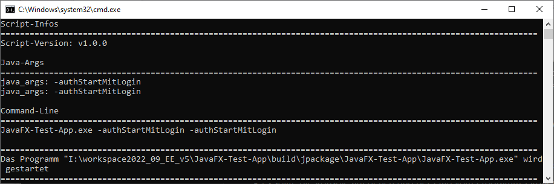

# Start .jar mit Batch-Datei

Dieses .bat-Script startet eine Java-Datei mit den JavaFX-Modules. Das Script kopiert KEINE Java-Version an einem anderen Ort, das script dient nur zur Fehlersuche

## Erklärung

- in der Datei `startScriptJava.bat` muss der Dateiname, der Datei angegeben werden, die gestartet werden soll, z.B. `set "startDatei=package.exe"`
- es kann in der Datei `startScriptJava.bat` der Output-Modus gewechselt werden `set "OUTPUT_MODE=CONSOLE"` oder `set "OUTPUT_MODE=LOG"`, beim Log-Modus wird in dem Ordner wo das Script ausgeführt wird, ein Ordner "logs" angelegt, in diesem Ordner befinden sich die Log-Dateien
- die Datei `startScriptJava.bat` muss im gleichen Ordner liegen, wie die Datei, die gestartet werden soll
- die Datei `startScriptJava.bat` selbst, kann beliebig umbenannt werden
- gestartet werden können dateien mit der Endung .jar
- gestartet werden können dateien mit der Endung .exe (nur wenn es sich um ein Java-Programm handelt, bzw. wenn die .jar-Datei in eine .exe-Datei umgewandelt wurde)

<br><br>

### Java-Version
Bei dem folgendem Abschnitt in der Datei `startScriptJava.bat` muss die bevorzugte Java-Version an der obersten stelle stehen, falls die gewünschte Java-Version nicht dabei ist, kann sie hinzugefügt werden, es muss aber die Zahlenreinfolge von `javaVersions[0]`, `javaVersions[1]`, `javaVersions[2]` beachtet werden, die Java-Version von `javaVersions[0]` wird als erstes verwendet, nach die `javaVersions[1]` usw.

```bat
rem Liste mit Versionsnummern, nach den gesucht werden sollen, die bevorzugte Version muss oben stehen 
set "javaVersions[0]=14.0.1"
set "javaVersions[1]=11.0.5"
set "javaVersions[2]=11.0.11"
set "javaVersions[3]=12.0.2"
set "javaVersions[4]=13.0.1"
```

<br><br>

### Speicherort der Java-Version
Bei dem folgendem Abschnitt in der Datei `startScriptJava.bat` muss der bevorzugte Speicherort der Java-Version an der obersten stelle stehen, falls der gewünschte Speicherort der Java-Version nicht dabei ist, kann er hinzugefügt werden, es muss aber die Zahlenreinfolge von `pfade[0]`, `pfade[1]`, `pfade[2]` beachtet werden, der Speicherort der Java-Version von `pfade[0]` wird als erstes verwendet, nach die `pfade[1]` usw.

```bat
rem Liste mit Pfaden, wo sich die Java-Versionen befinden könnten, der bevorzugte Pfad muss oben stehen
set "pfade[0]=C:\ProgramData\IndivikarAG\runtime\javaVers"
set "pfade[1]=!cd!\runtime"
set "pfade[2]=!cd!\runtime\javaVers"
```

<br><br>

### Start der Datei

Beim ersten Start der Datei `startScriptJava.bat` um das Java-Programm zu starten, wird voraussichtlich die Windows-Sicherheit folgende mMeldung anzeigen,
um den Start fortzuführen muss man den Text `Weitere Informationen` klicken und im Anschluss mit `Trotzdem ausführen` bestätigen.

<div align="center">
  
  
</div>

Danach sollte sich die Konsole von der Datei `startScriptJava.bat` öffnen, das sollte wie folgt aussehen

<div align="center">
  
</div>

Falls eine Java-Version gefunden wurde, kann man in der Konsole im oberen Abschnitt, unter `Gefundene Java-Version` die verwendete Java-Version und den Pfad zu dieser Java-Version sehen.

Wenn alles funktioniert hat, muss als letztes, in der Konsole folgendes da stehen (Pfad und Programm-Name können natürlich anders aussehen).
Alles was danach kommt, gehört zu dem Java-Programm, das gestartet werden soll.

```
===============================================================================================================
Das Programm "C:\Users\Inge\Desktop\StartEXEjar Test\package.exe" wird gestartet
===============================================================================================================
```


