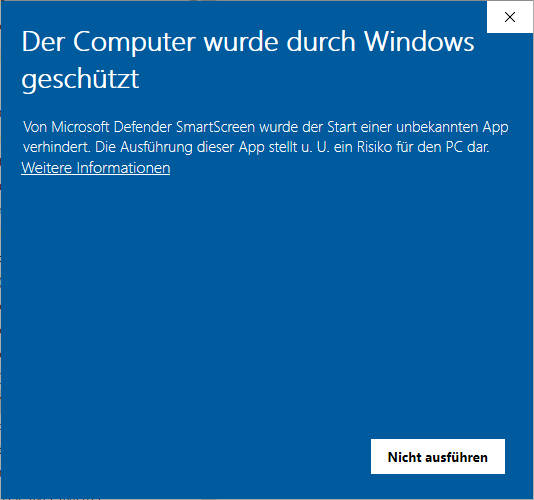

# Start .jar mit Batch-Datei

Dieses .bat-Script startet eine Java-Datei mit den JavaFX-Modules. Das Script kopiert KEINE Java-Version an einem anderen Ort, das script dient nur zur Fehlersuche

## Erklärung

- in der Datei `startScriptJavaJPackage.bat` muss der Dateiname, der Datei angegeben werden, die gestartet werden soll, z.B. `set "startDatei=package.exe"`
- es kann in der Datei `startScriptJavaJPackage.bat` der Output-Modus gewechselt werden `set "OUTPUT_MODE=CONSOLE"` oder `set "OUTPUT_MODE=LOG"`, beim Log-Modus wird in dem Ordner wo das Script ausgeführt wird, ein Ordner "logs" angelegt, in diesem Ordner befinden sich die Log-Dateien
- die Datei `startScriptJavaJPackage.bat` muss im gleichen Ordner liegen, wie die Datei, die gestartet werden soll
- die Datei `startScriptJavaJPackage.bat` selbst, kann beliebig umbenannt werden
- gestartet werden können dateien mit der Endung .exe, die mit jlink und jpackage erstellt wurden

<br><br>

### Start der Datei

Beim ersten Start der Datei `startScriptJavaJPackage.bat` um das Java-Programm zu starten, wird voraussichtlich die Windows-Sicherheit folgende mMeldung anzeigen,
um den Start fortzuführen muss man den Text `Weitere Informationen` klicken und im Anschluss mit `Trotzdem ausführen` bestätigen.

<div align="center">
  
  
</div>

Danach sollte sich die Konsole von der Datei `startScriptJavaJPackage.bat` öffnen, das sollte wie folgt aussehen

<div align="center">
  
</div>

Wenn alles funktioniert hat, muss als letztes, in der Konsole folgendes da stehen (Pfad und Programm-Name können natürlich anders aussehen).

```
===============================================================================================================
Das Programm "L:\meine_app\JavaFX-Test-App.exe" wird gestartet
===============================================================================================================
```

Alles was danach kommt, gehört zu dem Java-Programm, das gestartet werden soll.


